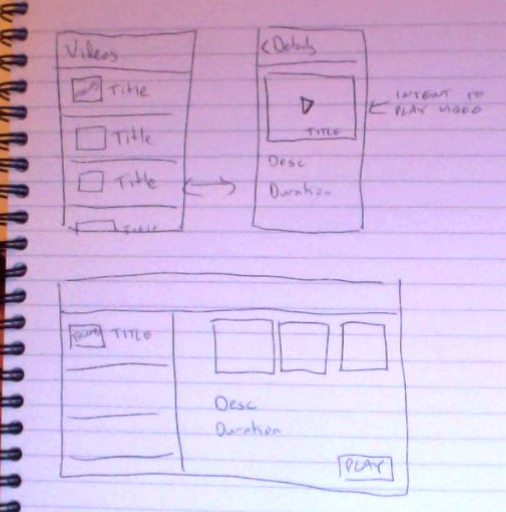

Most Popular YouTube Videos

## Decide on an app idea

- See a list of the 25 most popular YouTube videos - sick of your mates always seeing Video's before you
and you staring blankly, now you can be the one to say "HAVE YOU SEEN THIS?!"

## Write a summary describing what your app does and what problem it solves

 - App shows the most popular videos on youtube
 - You can select a video to see more details
 - You can choose to then play and watch the video

 - Problem it solves is: no more being the person following the conversation, start the conversation!

## Sketch mocks of all user-facing screens, and one alternative tablet screen

 - For mocks, see screen_mocks.png 

## Evaluate against rubric

 - tick
